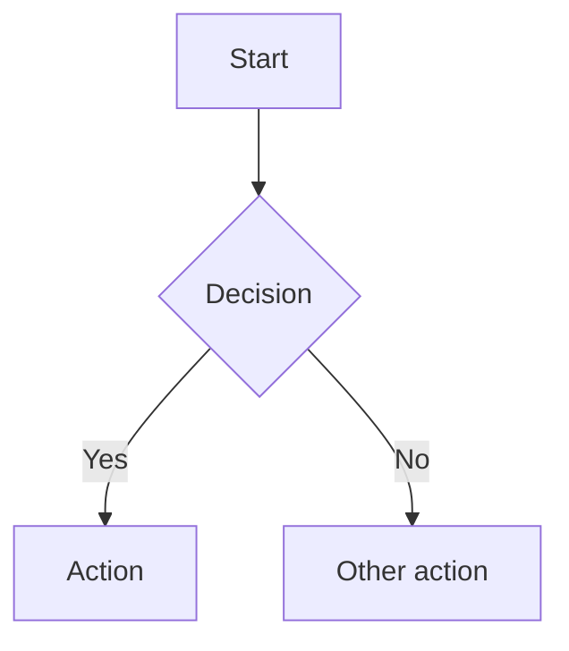

# Markdown Documentation

## Overview

Standards and practices for creating well-formatted, readable documentation using Markdown and GitHub Flavored Markdown (GFM).

## Critical Rules -- Writing Integrity

These rules are non-negotiable and override all other instructions.

### No AI Slop

- Never fabricate information. If unsure, say so explicitly.
- Never generate filler text, placeholder prose, or generic content to pad length.
- Every sentence must carry meaning. Remove anything that restates the obvious.
- Avoid weasel words: "simply", "just", "easily", "obviously", "of course".
- Avoid hollow qualifiers: "robust", "powerful", "seamless", "cutting-edge", "world-class", "state-of-the-art".
- Do not produce marketing copy disguised as documentation.
- Write for a technical reader who values precision over politeness.

### No Emojis or Emoticons

- Never use emoji characters in documentation output.
- Never use emoticon sequences (`:)`, `:/`, etc.).
- Never use GitHub emoji shortcodes (`:rocket:`, `:sparkles:`, etc.).
- Exception: only when the user explicitly requests them.

### No Hidden Unicode Artifacts

Prevent all invisible or suspicious Unicode characters that mark content as AI-generated:

- **Em dash** (`--`): Use two hyphens (`--`) or restructure the sentence. Never output `--`.
- **En dash** (`-`): Use a regular hyphen (`-`).
- **Zero-width spaces** (`U+200B`), **zero-width joiners** (`U+200D`), **zero-width non-joiners** (`U+200C`): Never include these.
- **Non-breaking spaces** (`U+00A0`): Use regular spaces only.
- **Smart/curly quotes** (`""''`): Use straight quotes (`"` `'`) exclusively.
- **Ellipsis character** (`...`): Use three periods (`...`) instead.
- **Other invisible markers**: No soft hyphens (`U+00AD`), no word joiners (`U+2060`), no BOM characters.

Run a mental check on every output: would a `hexdump` reveal anything beyond standard ASCII printable characters, newlines, and tabs? If yes, fix it.

### No Unicode Separator Decorators in Code or Config

Never use Unicode box-drawing characters (`─` U+2500, `━` U+2501, `═` U+2550, etc.) as decorative section separators in code comments or configuration files. This pattern:

```
# ── section name ──────────────────────────────────────────────
// ── State ─────────────────────────────────────────────────────
```

is AI slop. It appears in no Rust, TOML, Solidity, or any other language standard. It is invisible noise in diffs, fails to render meaningfully in most editors, and is a reliable marker of low-quality AI-generated content. Use plain labels or ASCII hyphens if a visual break is truly needed:

```
# section name
// ---
```

## When to Apply

- README files
- Documentation pages
- GitHub/GitLab wikis
- When writing essays and blogs
- Technical writing and guides
- Project documentation
- Changelog and contributing guides
- API documentation

## Documentation Structure

### File Organization

```
docs/
  README.md
  CONTRIBUTING.md
  CHANGELOG.md
  LICENSE
  CODE_OF_CONDUCT.md
  SECURITY.md
  guides/
    getting-started.md
    installation.md
    configuration.md
  api/
    authentication.md
    endpoints.md
    errors.md
```

### Heading Hierarchy

- One `# H1` per document (the title).
- Use `## H2` for major sections.
- Use `### H3` for subsections. Rarely go deeper than `####`.
- Never skip levels (e.g., `##` to `####`).
- Keep headings concise and descriptive -- they double as anchor links.

### Table of Contents

Include a ToC for documents exceeding ~3 screens of content:

```markdown
## Table of Contents

- [Section One](#section-one)
- [Section Two](#section-two)
  - [Subsection](#subsection)
```

## Writing Style

### Tone

- Direct and declarative. Prefer imperative mood for instructions.
- Technical accuracy over conversational warmth.
- Assume the reader is competent. Do not over-explain standard concepts.

### Sentence Structure

- One idea per paragraph. Paragraphs should be focused, not artificially short.
- Lead with the most important information.
- Use lists when presenting 3+ related items.
- Never split a sentence with a hard line break to enforce paragraph brevity.

### Code References

- Always specify the language in fenced code blocks.
- Use inline code for: file names, function names, variable names, CLI commands, config keys.
- Use code blocks for: multi-line code, configuration files, terminal output.

### Links

- Use descriptive link text. Never use "click here" or "this link".
- Prefer relative paths for internal documentation links.
- Verify links are not broken before finalizing.

### Images

- Always include alt text that describes the image content.
- Never use images as the sole carrier of textual information (accessibility).
- Prefer SVG or diagrams-as-code (Mermaid) over raster screenshots where possible.

## GFM-Specific Features

### Alerts (Admonitions)

Use GitHub's alert syntax for callouts:

```markdown
> [!NOTE]
> Supplementary information the reader should be aware of.

> [!TIP]
> Advice to help the reader succeed.

> [!IMPORTANT]
> Key information the reader needs to know.

> [!WARNING]
> Urgent information about potential problems.

> [!CAUTION]
> Consequences of an action that could cause harm.
```

### Task Lists

```markdown
- [x] Completed item
- [ ] Pending item
```

### Collapsible Sections

Use for supplementary content that would otherwise clutter the main flow:

```markdown
<details>
<summary>Additional details</summary>

Content hidden by default.

</details>
```

### Mermaid Diagrams

Prefer Mermaid over image-based diagrams when the diagram is structural (flowcharts, sequences, ER diagrams):

````markdown

````

## Formatting Rules

### Line Length

Do not impose artificial line length limits on prose. Never insert hard line breaks (`\n`) mid-sentence or mid-paragraph to meet a column width. Let paragraphs flow as continuous text -- renderers wrap naturally and hard breaks create broken, choppy output in rendered views.

Hard line breaks are only appropriate in:
- Code blocks and terminal output (where they are structurally meaningful)
- Markdown tables (one row per line)
- List items that are genuinely separate entries
- Headings

Never break a sentence across lines just to stay under an arbitrary character limit.

### Tables

- Align columns for readability in source.
- Use alignment syntax (`:---`, `:---:`, `---:`) when it aids comprehension.
- Prefer tables over nested lists for structured data with consistent fields.

### Badges

Place badges immediately after the H1 title, before any prose. Use shields.io format:

```markdown
# Project Name

[](...)
[](LICENSE)
```

## Anti-Patterns

- Walls of text with no visual breaks.
- Headings that don't describe their section content.
- Mixed HTML and Markdown without justification.
- Absolute paths to local files in documentation.
- Language-unspecified code blocks.
- Nested blockquotes beyond two levels.
- Tables with excessive columns that break on narrow viewports.
- **Hard line breaks mid-sentence or mid-paragraph** to enforce a column limit. Prose must flow as continuous text; let the renderer wrap it.

## Additional Resources

- For full Markdown syntax reference, see [reference.md](reference.md)
- For README and documentation templates, see [templates.md](templates.md)
