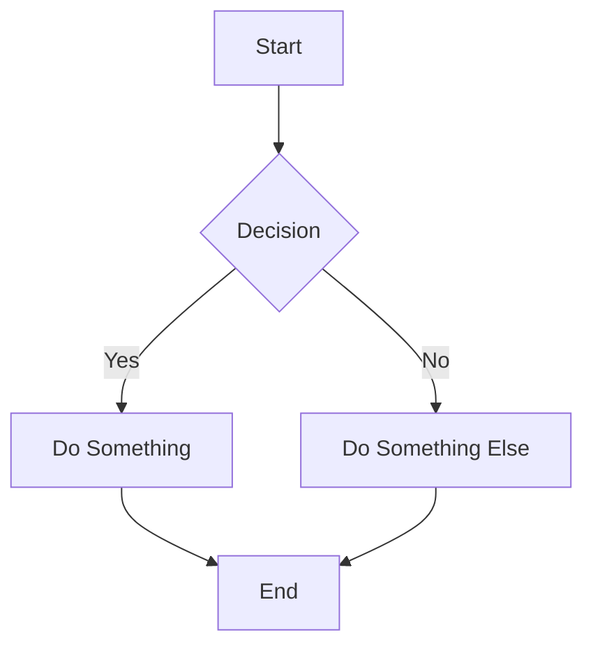
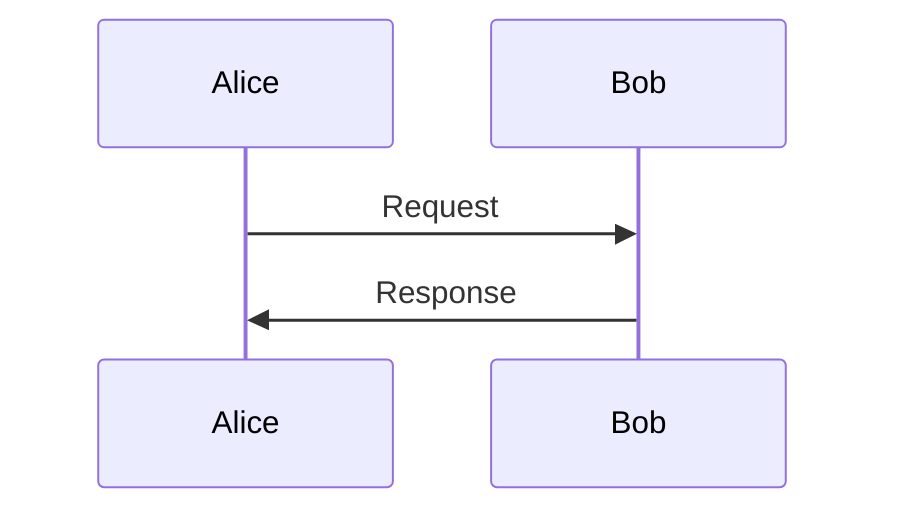

# Markdown Syntax Reference

Complete syntax reference for standard Markdown and GitHub Flavored Markdown (GFM).

## Headers

```markdown
# H1 Header
## H2 Header
### H3 Header
#### H4 Header
##### H5 Header
###### H6 Header

Alternative H1
==============

Alternative H2
--------------
```

## Text Formatting

```markdown
**Bold text**
__Also bold__

*Italic text*
_Also italic_

***Bold and italic***
___Also bold and italic___

~~Strikethrough~~

`Inline code`

> Blockquote
> Multiple lines
> in blockquote

---
Horizontal rule (also ___ or ***)
```

## Lists

```markdown
Unordered list:
- Item 1
- Item 2
  - Nested item 2.1
  - Nested item 2.2
- Item 3

Ordered list:
1. First item
2. Second item
   1. Nested item 2.1
   2. Nested item 2.2
3. Third item

Task list (GFM):
- [x] Completed task
- [ ] Incomplete task
```

## Links and Images

```markdown
[Link text](https://example.com)
[Link with title](https://example.com "Link title")

Reference-style link:
[Link text][ref-id]
[ref-id]: https://example.com

Automatic link:
<https://example.com>
<email@example.com>


Reference-style image:
![Alt text][img-ref]
[img-ref]: image.png
```

## Code Blocks

````markdown
Inline code: `const x = 5;`

Fenced code block with language:
```javascript
function hello(name) {
  console.log(`Hello, ${name}!`);
}
```

Indented code block (4 spaces):
    const x = 5;
    console.log(x);
````

## Tables

```markdown
| Column 1 | Column 2 | Column 3 |
|----------|----------|----------|
| Row 1    | Data     | Data     |
| Row 2    | Data     | Data     |

Aligned columns:
| Left     | Center   | Right    |
|:---------|:--------:|---------:|
| Left     | Center   | Right    |
```

## GFM Extensions

### Footnotes

```markdown
Text with a footnote[^1].

[^1]: This is the footnote content.
```

### Alerts

```markdown
> [!NOTE]
> Supplementary information.

> [!TIP]
> Helpful advice.

> [!IMPORTANT]
> Key information.

> [!WARNING]
> Potential problems.

> [!CAUTION]
> Possible negative consequences.
```

### Issue/PR References

```markdown
#123
GH-123
username/repo#123
@username
@org/team-name
```

### Collapsible Sections

```markdown
<details>
<summary>Click to expand</summary>

Hidden content here.

</details>
```

### Mermaid Diagrams

````markdown



````

## Custom Anchors

```markdown
<a name="custom-anchor"></a>
## Section Title

Link to it: [Jump to section](#custom-anchor)
```

## Linking Between Documents

```markdown
[Another doc](guides/installation.md)
[Section in current doc](#configuration)
[Section in another doc](api/auth.md#oauth2)
```

## Badges (shields.io)

```markdown


```

## Common Languages for Fenced Blocks

`javascript`, `typescript`, `python`, `bash`, `go`, `rust`, `java`, `sql`, `json`, `yaml`, `html`, `css`, `dockerfile`, `graphql`, `markdown`, `diff`, `hcl`

## Tooling

### Linting

```bash
npm install -g markdownlint-cli
markdownlint '**/*.md'
```

`.markdownlint.json`:
```json
{
  "default": true,
  "MD013": false,
  "MD033": false
}
```

### Formatting

```bash
npm install -g prettier
prettier --write '**/*.md'
```

### Preview

```bash
pip install grip
grip README.md
```
