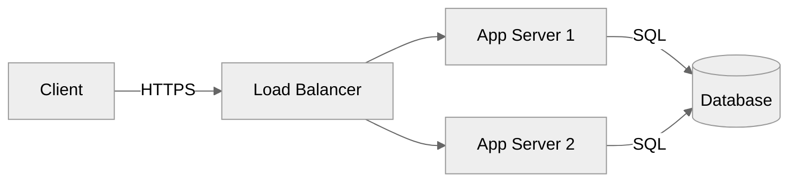
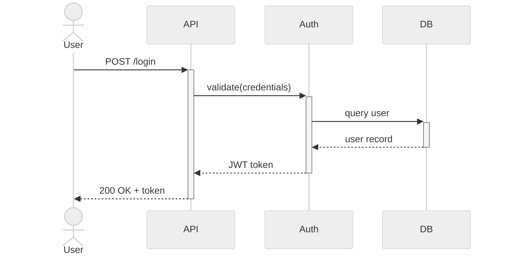

# Mermaid Diagrams

Generate clean, professional Mermaid diagrams. Prioritize clarity and precision over decoration.

## Workflow

1. Identify the diagram type (see [reference.md](reference.md))
2. Extract entities, relationships, and flow from the description
3. Generate Mermaid source with proper config frontmatter
4. Render inline in a fenced code block (` ```mermaid `)
5. If the user requests Excalidraw, follow the **Excalidraw Export** section

## Config Frontmatter (always include)

Every diagram must open with a YAML config block:

```
---
config:
  theme: neutral
  look: classic
---
```

**Theme options:** `neutral` (default, professional), `default`, `dark`, `forest`, `base`

Use `look: handDrawn` only if the user explicitly requests a sketch style.

## Core Principles

- **One concept per node** - split complex labels across lines with `<br/>`
- **Direction matters** - use `LR` for pipelines/flows, `TD` for hierarchies
- **Label every edge** that carries semantic meaning
- **Group with subgraphs** when there are more than 6 nodes in a cluster
- **Avoid crossing edges** - reorder nodes to minimize visual clutter
- **Never use raw IDs as labels** - every visible node needs a human-readable label

## Styling

Apply styles sparingly for semantic emphasis only (not decoration):

```
classDef primary fill:#4A90D9,stroke:#2C5F8A,color:#fff
classDef secondary fill:#F5F5F5,stroke:#999,color:#333
classDef warning fill:#E8A838,stroke:#B07820,color:#fff
classDef danger fill:#D94A4A,stroke:#8A2C2C,color:#fff
classDef success fill:#4AAD6A,stroke:#2C7A45,color:#fff
```

Assign with `class NodeA,NodeB primary`.

For linkStyle, prefer: `linkStyle 0 stroke:#4A90D9,stroke-width:2px`

## Diagram Type Selection

| Intent | Type |
|--------|------|
| Steps, pipelines, decisions | `flowchart` |
| Time-ordered interactions | `sequenceDiagram` |
| OOP / data models | `classDiagram` |
| Database schema | `erDiagram` |
| Git branching | `gitGraph` |
| Schedule / timeline | `gantt` |
| Concept hierarchy / brainstorm | `mindmap` |
| States and transitions | `stateDiagram-v2` |
| Component/system topology | `C4Context` or `flowchart` with subgraphs |

For detailed syntax of each type, see [reference.md](reference.md).

## Quality Checklist

Before delivering a diagram:
- [ ] Config frontmatter present with `theme: neutral`
- [ ] All nodes have readable labels (not raw IDs)
- [ ] Edge labels present where semantically meaningful
- [ ] No more than ~12 top-level nodes (split into subgraphs if needed)
- [ ] Direction chosen intentionally (`LR` vs `TD`)
- [ ] Fenced in ` ```mermaid ` block

## Excalidraw Export

If the user asks to convert to Excalidraw (keywords: "excalidraw", "export to excalidraw", "make it editable"):

**Option A - Browser (recommended, no dependencies):**
1. Go to [excalidraw.com](https://excalidraw.com)
2. Open the hamburger menu → "Mermaid to Excalidraw"
3. Paste the Mermaid source → click "Insert"

**Option B - CLI with `@excalidraw/mermaid-to-excalidraw`:**
```bash
npx @excalidraw/mermaid-to-excalidraw --input diagram.mmd --output diagram.excalidraw
```

**Option C - Programmatic (Node.js):**
```js
import { parseMermaidToExcalidraw } from "@excalidraw/mermaid-to-excalidraw";
const { elements, files } = await parseMermaidToExcalidraw(mermaidSyntax);
```

**Supported types for conversion:** flowchart, sequenceDiagram, classDiagram, stateDiagram, erDiagram, gantt, gitGraph, C4Context

**Not supported:** mindmap, timeline, requirementDiagram - offer a flowchart equivalent if needed.

When exporting, always provide the raw Mermaid source as well so the user retains the editable canonical form.

## Examples

### Minimal flowchart


### Sequence with activation

