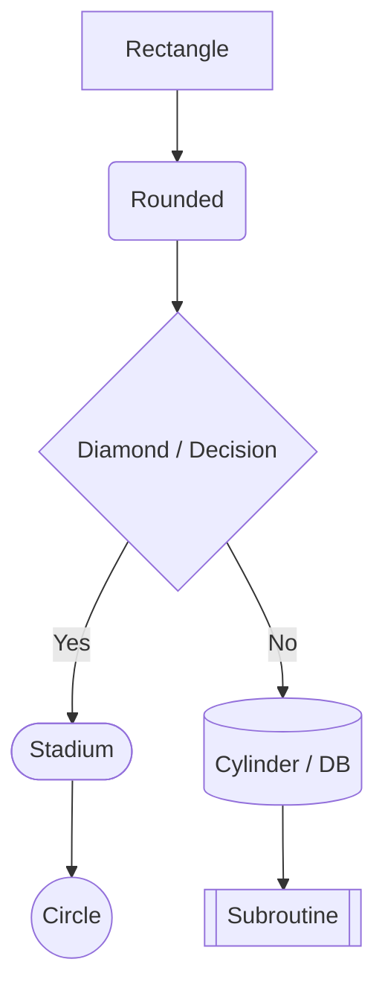
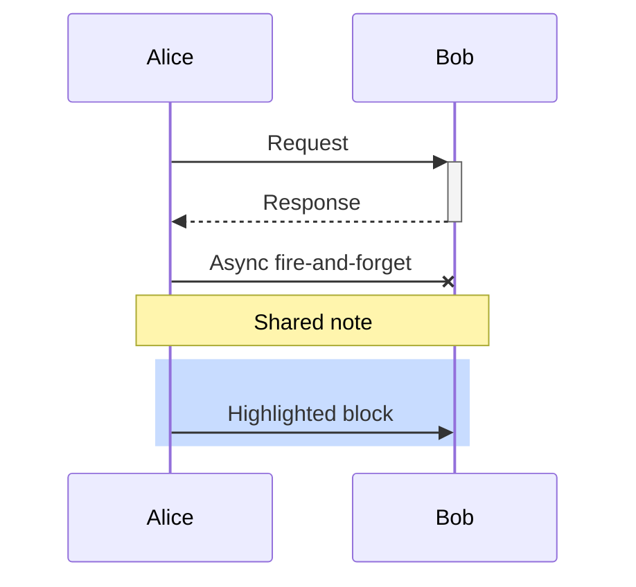
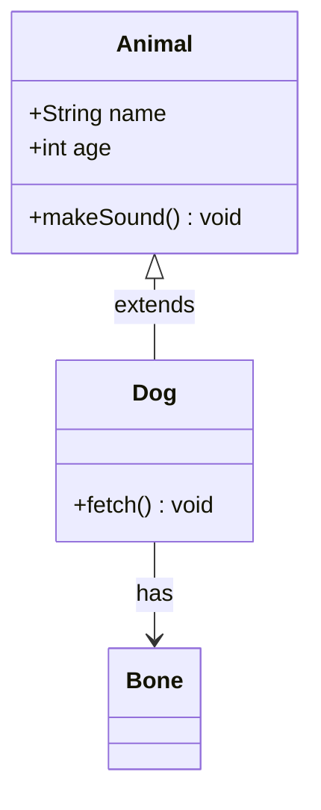
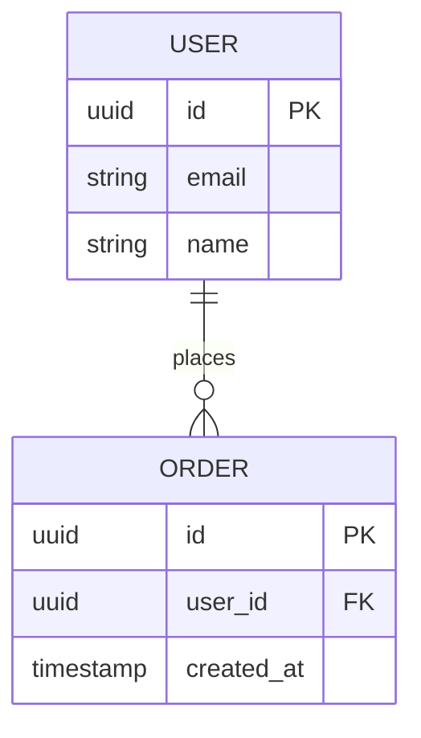
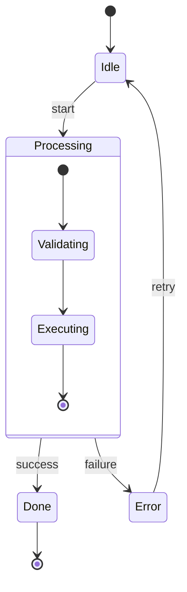
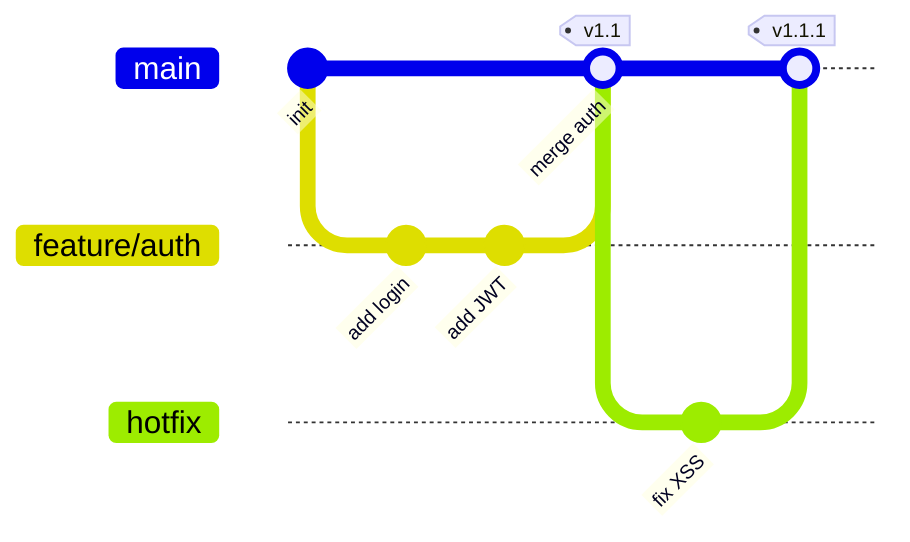
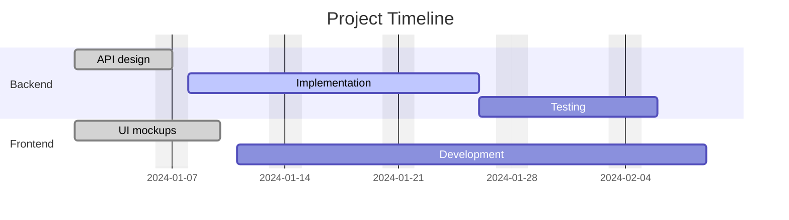
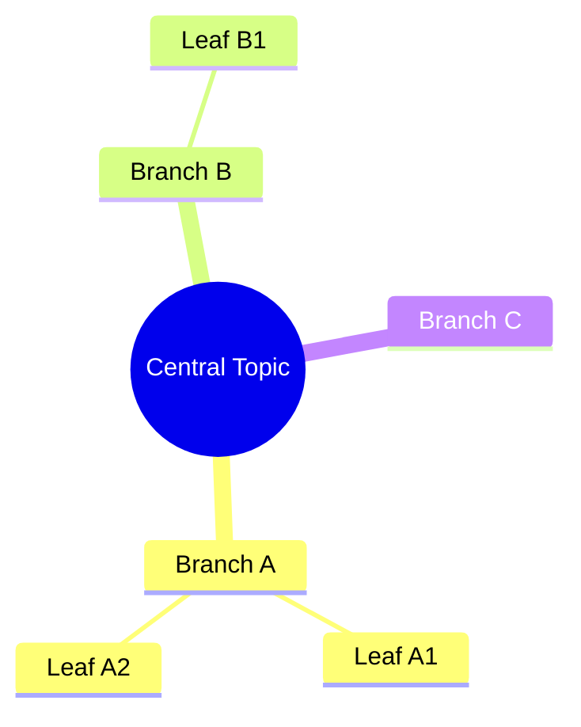
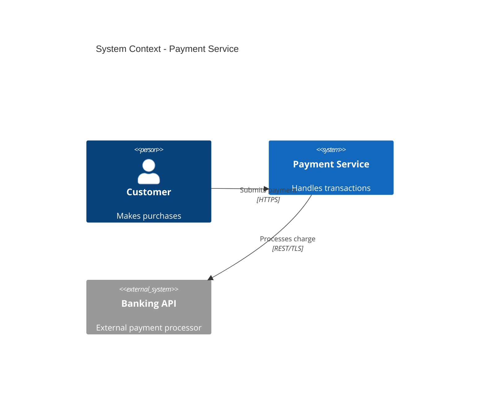

# Mermaid Syntax Reference

Quick reference for each supported diagram type.

---

## flowchart



**Directions:** `TD` (top-down), `LR` (left-right), `BT`, `RL`

**Node shapes:**

| Shape | Syntax |
|-------|--------|
| Rectangle | `[label]` |
| Rounded | `(label)` |
| Stadium | `([label])` |
| Subroutine | `[[label]]` |
| Cylinder (DB) | `[(label)]` |
| Circle | `((label))` |
| Diamond | `{label}` |
| Hexagon | `{{label}}` |
| Trapezoid | `[/label/]` |

**Edge types:**

| Edge | Syntax |
|------|--------|
| Arrow | `-->` |
| Open | `---` |
| Dotted | `-.->` |
| Thick | `==>` |
| Labeled | `-->|text|` |
| Bidirectional | `<-->` |

**Subgraphs:**
```
subgraph name [Title]
    A --> B
end
```

---

## sequenceDiagram



**Arrow types:**

| Type | Syntax | Meaning |
|------|--------|---------|
| Solid arrow | `->>` | Sync message |
| Dashed arrow | `-->>` | Response |
| Solid, no arrow | `->` | |
| Cross | `-x` | Async / fire-and-forget |
| Open | `-)` | Async |

**Activation:** `+` activates, `-` deactivates the participant lifeline.

**Loops / alt / opt:**
```
loop Every minute
    A->>B: ping
end

alt condition
    A->>B: path 1
else
    A->>B: path 2
end

opt optional
    A->>B: optional step
end
```

---

## classDiagram



**Relationships:**

| Symbol | Meaning |
|--------|---------|
| `<|--` | Inheritance |
| `*--` | Composition |
| `o--` | Aggregation |
| `-->` | Association |
| `--` | Link |
| `..>` | Dependency |
| `..|>` | Realization |

**Visibility:** `+` public, `-` private, `#` protected, `~` package/internal

**Cardinality:** `"1"`, `"0..*"`, `"1..*"` on relationship lines

---

## erDiagram



**Cardinality notation:**

| Left | Right | Meaning |
|------|-------|---------|
| `||` | `||` | Exactly one to exactly one |
| `||` | `o{` | One to zero or more |
| `||` | `|{` | One to one or more |
| `o|` | `o{` | Zero or one to zero or more |

**Attribute types:** `string`, `int`, `float`, `boolean`, `uuid`, `timestamp`, `date`

**Keys:** `PK` primary key, `FK` foreign key, `UK` unique key

---

## stateDiagram-v2



Use `state "Label with spaces" as alias` for states with special characters.

---

## gitGraph



**Commit types:** `NORMAL` (default), `HIGHLIGHT`, `REVERSE`

---

## gantt



**Status tags:** `done`, `active`, `crit`, `milestone`

---

## mindmap



**Node shapes:**
- `((text))` - circle
- `(text)` - rounded
- `[text]` - square
- `{{text}}` - hexagon
- No brackets - default cloud

Note: mindmap cannot be converted to Excalidraw via `mermaid-to-excalidraw`. Use a `flowchart` equivalent if Excalidraw export is needed.

---

## C4Context (Architecture)



**C4 element types:** `Person`, `System`, `System_Ext`, `Container`, `Component`

**Relationship:** `Rel(from, to, label)` or `Rel(from, to, label, tech)`

---

## Theme Config Reference

```yaml
---
config:
  theme: neutral          # neutral | default | dark | forest | base
  look: classic           # classic | handDrawn
  fontFamily: "monospace" # any CSS font-family
  fontSize: 14
  flowchart:
    curve: basis          # basis | linear | step | stepBefore | stepAfter
    padding: 20
  sequence:
    mirrorActors: false
    showSequenceNumbers: true
---
```

For `base` theme, custom variables are available:

```yaml
---
config:
  theme: base
  themeVariables:
    primaryColor: "#4A90D9"
    primaryTextColor: "#fff"
    primaryBorderColor: "#2C5F8A"
    lineColor: "#666"
    secondaryColor: "#F5F5F5"
    tertiaryColor: "#E8F4FD"
---
```
